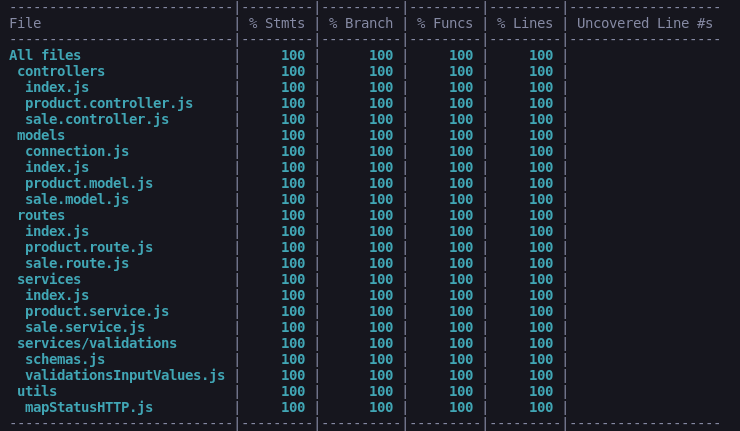

# 
Projeto Store Manager

## Contexto

Este projeto consiste em uma `API completamente RESTful` para gerenciamento de vendas, utilizando `Node.js` com `Express` seguindo a `arquitetura em camadas`. Nela é possível criar, visualizar, deletar e atualizar produtos e vendas. Além disso, a aplicação possui uma boa cobertura de teste, utilizando `mocha`, `chai` e `sinon`.

### Cobertura de teste:

## Competências desenvolvidas

- Habilidade para implementar API utilizando arquitetura em camadas.
- Habilidade para teste unitário.
- Habilidade para teste de integração
